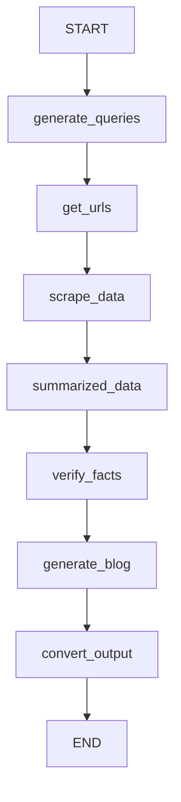

# 🤖 Blogging Agents - AI-Powered Blog Content Generation Service

<div align="center">


**Blogging Agents** is an AI-powered content generation service that automates the entire blog writing process. Using advanced AI agents, web search, intelligent scraping, and Google's Gemini AI, it transforms any topic into a professionally written, SEO-optimized blog post.

</div>

---

## 🌟 What This AI System Does

This service is designed to **create AI-generated blogs automatically**. Given just a topic, the system:

1. **🔍 Searches the Web** - Uses DuckDuckGo to find relevant sources
2. **📄 Scrapes Content** - Extracts and processes information from multiple websites
3. **🧠 AI Processing** - Uses Google Gemini to analyze, summarize, and generate content
4. **✅ Fact Verification** - (Deep Research) Cross-references facts with additional searches
5. **✍️ Blog Generation** - Creates SEO-optimized, human-like blog content
6. **🖼️ Featured Image** - Automatically finds and validates appropriate images
7. **📝 HTML Output** - Converts Markdown output to clean, sanitized HTML

---

## 🚀 Two Research Modes

### ⚡ Quick Research Mode
Fast content generation using a streamlined pipeline:

```
Topic → Web Search → Scrape URLs → Generate Blog → HTML Output
```

- **Best for**: Time-sensitive content, simpler topics
- **Speed**: ~30-60 seconds
- **Pipeline**: LangChain RunnableSequence

### 🔬 Deep Research Mode
Comprehensive research with fact verification using an intelligent state graph:

```
Topic → Query Planning → Multi-Search → Scrape → Summarize → Verify Facts → Generate Blog → HTML
```

- **Best for**: In-depth articles, complex topics, accuracy-critical content
- **Speed**: ~2-5 minutes
- **Pipeline**: LangGraph StateGraph with 7 nodes

---

## 🏗️ Architecture Overview

```
┌─────────────────────────────────────────────────────────────────┐
│                         FastAPI Server                          │
│                        (main.py:8001)                           │
├─────────────────────────────────────────────────────────────────┤
│                                                                 │
│  ┌─────────────────┐              ┌──────────────────────────┐  │
│  │  Quick Research │              │     Deep Research        │  │
│  │  (RunnableSeq)  │              │     (LangGraph)          │  │
│  │                 │              │                          │  │
│  │  1. WebSearch   │              │  1. generate_queries     │  │
│  │  2. WebScrape   │              │  2. get_urls             │  │
│  │  3. Generate    │              │  3. scrape_data          │  │
│  └────────┬────────┘              │  4. summarized_data      │  │
│           │                       │  5. verify_facts         │  │
│           │                       │  6. generate_blog        │  │
│           │                       │  7. convert_output       │  │
│           │                       └─────────────┬────────────┘  │
│           │                                     │               │
│           └──────────────┬──────────────────────┘               │
│                          ▼                                      │
│  ┌───────────────────────────────────────────────────────────┐  │
│  │                     Shared Tools                          │  │
│  │  • Search (DuckDuckGo)    • WebScraper (BS4/newspaper3k)  │  │
│  │  • FeaturedImageExtractor • MarkdownToHTML (mistune)      │  │
│  └───────────────────────────────────────────────────────────┘  │
│                          │                                      │
│                          ▼                                      │
│  ┌───────────────────────────────────────────────────────────┐  │
│  │              Google Gemini AI Integration                 │  │
│  │         (Structured Output with Pydantic Models)          │  │
│  │    • gemini-2.0-flash (blog generation)                   │  │
│  │    • gemini-2.5-flash (summarization, fact verification)  │  │
│  └───────────────────────────────────────────────────────────┘  │
│                                                                 │
└─────────────────────────────────────────────────────────────────┘
```

---

## 📂 Project Structure

```
blogging_agents/
├── main.py                 # FastAPI application entry point
│
├── QuickResearch/          # Quick research pipeline
│   └── quickresearch.py    # LangChain RunnableSequence implementation
│
├── DeepResearch/           # Deep research pipeline  
│   ├── deepresearch.py     # LangGraph StateGraph implementation
│   └── tools.py            # Deep research specific tools
│
├── QueryPlanner/           # AI query planning
│   └── planner.py          # Generates 5 strategic search queries
│
├── Tools/                  # Shared utility tools
│   ├── search.py           # DuckDuckGo search integration
│   ├── scraper.py          # Web scraping (BS4 + newspaper3k)
│   └── featuredimage.py    # Featured image extraction & validation
│
├── Google_Genai/           # Google AI integration
│   └── googlegenai.py      # Gemini structured output wrapper
│
├── Markdown/               # Content conversion
│   └── toHTML.py           # Markdown to HTML (mistune + bleach)
│
├── dockerfile              # Container configuration
├── requirements.txt        # Python dependencies
└── envExample.txt          # Environment variable template
```

---

## 🛠️ Tech Stack

| Component | Technology | Purpose |
|-----------|------------|---------|
| **API Framework** | FastAPI | Async REST API server |
| **AI Orchestration** | LangChain, LangGraph | Agent pipelines and state management |
| **AI Model** | Google Gemini (2.0-flash, 2.5-flash) | Content generation & analysis |
| **Web Search** | DuckDuckGo (ddgs) | Privacy-focused web search |
| **Web Scraping** | BeautifulSoup4, newspaper3k, readability | Content extraction |
| **Markdown** | Mistune | Markdown parsing |
| **Sanitization** | Bleach | HTML sanitization |
| **Validation** | Pydantic | Data validation & structured output |
| **Server** | Uvicorn | ASGI server |
| **Containerization** | Docker | Deployment |

---

## 📡 API Reference

### Health Check
```http
GET /
```

**Response:**
```json
{
  "message": "AI Blogging Agents API is running",
  "status": "healthy"
}
```

### Generate Blog
```http
POST /generate_blog
```

**Request Body:**
```json
{
  "topic": "string (required)",
  "max_results": 10,
  "word_count": 1000,
  "scrape_thumbnail": false,
  "method": "quick"
}
```

| Parameter | Type | Default | Description |
|-----------|------|---------|-------------|
| `topic` | string | Required | The blog topic to research and write about |
| `max_results` | int | 10 | Maximum number of search results to process |
| `word_count` | int | 1000 | Target word count for the generated blog |
| `scrape_thumbnail` | bool | false | Whether to find and include a featured image |
| `method` | string | "quick" | Research method: `"quick"` or `"deep"` |

**Response:**
```json
{
  "blog_data": {
    "title": "SEO-Optimized Blog Title",
    "excerpt": "Compelling excerpt for previews (max 200 chars)",
    "content": "<p>Full HTML-formatted blog content...</p>",
    "tags": ["tag1", "tag2", "tag3"]
  },
  "featured_image": {
    "success": true,
    "image_url": "https://example.com/image.jpg"
  }
}
```

---

## 🧠 AI Content Generation Process

### Blog Prompt Engineering

The AI generates content following strict guidelines:

- **Originality**: Rewrites ideas uniquely, never copies
- **Accuracy**: Uses only provided research data
- **Style**: Conversational, authoritative, 12th-grade reading level
- **SEO**: Keywords in title, headings, and first 100 words
- **Structure**: Markdown with proper headings, lists, tables, and code blocks
- **Avoids AI Clichés**: No "In today's fast-paced world..." or "In conclusion..."

### Generated Output Structure

```typescript
{
  title: string,      // SEO-optimized title
  excerpt: string,    // 200-char max preview
  content: string,    // Full Markdown/HTML content
  tags: string[]      // Up to 10 relevant tags
}
```

---

## 🔧 Deep Research Pipeline (LangGraph)

The Deep Research mode uses a sophisticated state graph:



### State Schema
```python
class BlogState(TypedDict):
    topic: str
    word_count: int
    queries: list[str]           # AI-generated search queries
    urls: list[str]              # Found URLs
    data: list[dict]             # Scraped content
    summarized_results: dict     # Summarized content per source
    facts_to_verify: list[str]   # Key facts needing verification
    verified_facts: list[dict]   # Verified fact results
    title: str
    excerpt: str
    content: str
    tags: list[str]
```

---

## 🔍 Query Planning (Deep Research)

The QueryPlanner generates 5 strategic search queries covering:

1. **Foundational/Definitional** - Core concepts
2. **How-to/Practical** - Actionable advice
3. **Specific Sub-topics** - Deep dives
4. **Data/Statistics** - Evidence and support
5. **Unique Angles** - Expert opinions, trends, controversies

---

## 🖼️ Featured Image Extraction

The FeaturedImageExtractor:

- Checks Open Graph (`og:image`) and Twitter Card meta tags
- Scans article content for suitable images
- Validates image format (JPEG, PNG, WebP only)
- Verifies file size (max 5MB)
- Analyzes dimensions for optimal quality
- Skips icons, logos, avatars, and ads

---

## 🚀 Getting Started

### Prerequisites
- Python 3.13+
- Google AI API Key (Gemini access)

### Installation

```bash
# Clone the repository
git clone https://github.com/HamadKhan345/blogging_agents.git
cd blogging_agents

# Create virtual environment
python -m venv venv
source venv/bin/activate  # Linux/Mac
# or
.\venv\Scripts\activate   # Windows

# Install dependencies
pip install -r requirements.txt

# Set up environment variables
echo "GOOGLE_API_KEY=your-google-api-key" > .env
```

### Running the Server

```bash
# Development
uvicorn main:app --host 127.0.0.1 --port 8001 --reload

# Production
uvicorn main:app --host 0.0.0.0 --port 8001 --workers 2
```

The API will be available at `http://localhost:8001`

---

## 🐳 Docker Deployment

```bash
# Build the image
docker build -t blogging-agents .

# Run the container
docker run -d \
  -p 8001:8000 \
  -e GOOGLE_API_KEY=your-api-key \
  blogging-agents
```

---

## ⚙️ Configuration

### Environment Variables

| Variable | Required | Description |
|----------|----------|-------------|
| `GOOGLE_API_KEY` | Yes | Google AI API key for Gemini access |

### Default Settings

| Setting | Value |
|---------|-------|
| Default Port | 8001 |
| Request Timeout | 10 seconds |
| Max Image Size | 5 MB |
| Scrape Delay | 1 second between requests |
| Max Retries | 4 (for AI generation) |

---

## 🔗 Integration with AutoBlog

This service is designed to work as the AI backend for the **AutoBlog** Django application:

1. AutoBlog sends a POST request to `/generate_blog`
2. Blogging Agents researches and generates content
3. Response contains complete blog data ready for publishing
4. AutoBlog creates the blog post in the database

```python
# AutoBlog integration example
payload = {
    'topic': 'Your Blog Topic',
    'max_results': 10,
    'word_count': 700,
    'scrape_thumbnail': True,
    'method': 'quick'  # or 'deep'
}

response = await client.post(
    "http://localhost:8001/generate_blog",
    json=payload,
    timeout=900
)
```

---

## 📝 Example Usage

### Quick Research (Python)
```python
import requests

response = requests.post(
    "http://localhost:8001/generate_blog",
    json={
        "topic": "Benefits of Remote Work in 2025",
        "word_count": 800,
        "method": "quick",
        "scrape_thumbnail": True
    }
)

data = response.json()
print(f"Title: {data['blog_data']['title']}")
print(f"Tags: {data['blog_data']['tags']}")
```

### Deep Research (cURL)
```bash
curl -X POST http://localhost:8001/generate_blog \
  -H "Content-Type: application/json" \
  -d '{
    "topic": "The Future of Artificial Intelligence",
    "word_count": 1500,
    "method": "deep",
    "scrape_thumbnail": true
  }'
```

---

## ⚠️ Rate Limiting & Best Practices

- **Delay between scrapes**: 1 second (configurable)
- **AI retry with backoff**: 5 seconds between retries
- **Request timeout**: 10 seconds for web requests
- **Respectful scraping**: User-Agent header included

---

## 🔒 Security Features

- HTML sanitization via **Bleach** (XSS prevention)
- Allowed HTML tags whitelist
- Input validation via **Pydantic**
- No persistent data storage (stateless API)

---

## 📄 License

This project is proprietary software. All rights reserved.

---

<div align="center">

*Automate your content creation with intelligent AI agents*

</div>
